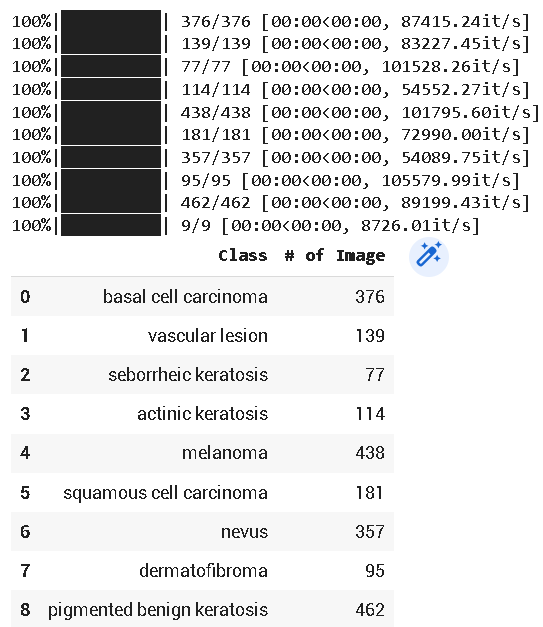
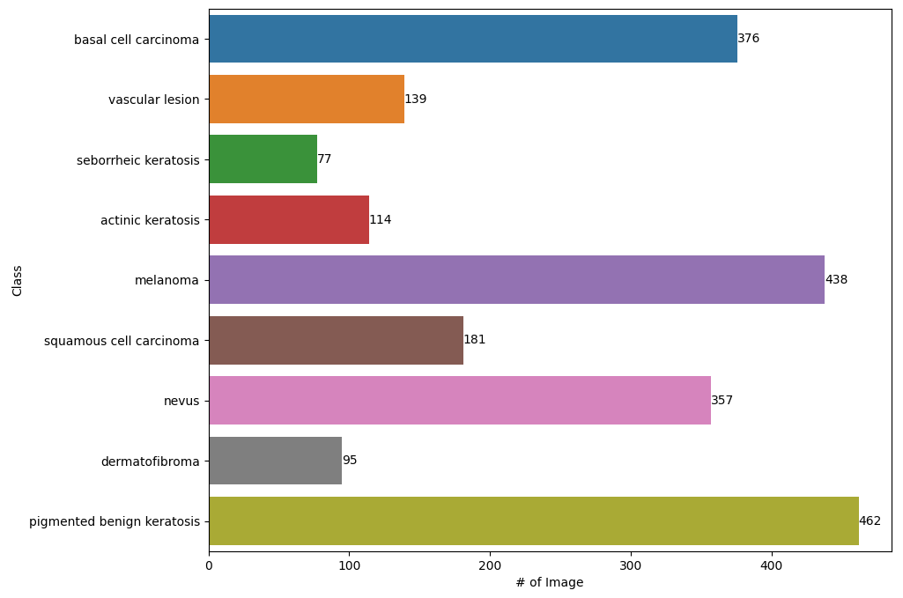
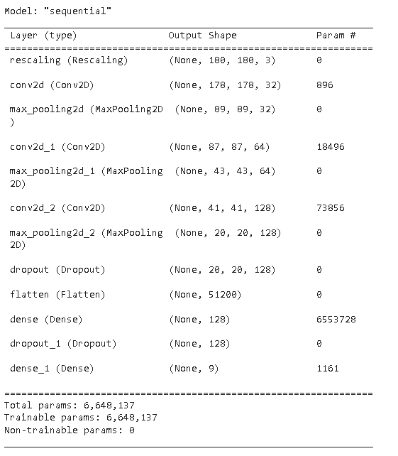

# Abstract

There are over 200 different cancer. Melanoma is one of the deadliest skin cancers.

The diagnostic procedure for melanoma begins with a clinical exam to evaluate your skin for any new changes, followed by a dermatoscope to look for changes in your skin, and then a biopsy to confirm if it is indeed cancer.

Skin cancer is curable if it’s diagnosed early and treated effectively.

The first step of melanoma skin cancer diagnosis is to look for suspicious changes in your skin, such as new or changing moles, a change in your skin’s texture, or any other changes.

Dermatologists use the high-speed video imaging system that takes the images of the skin lesions by the high-speed camera, which has an accuracy of 65-80% in the melanoma diagnosis with no additional technical support.

The overall prediction rate of melanoma diagnoses has increased by 12%, thanks to further visual inspection by cancer treatment specialists and images of melanomas taken using dermatoscopy, a new technology which improves the appearance and clarity of the skin’

# Problem statement

To build a CNN based model which can accurately detect melanoma. Melanoma is a type of cancer that can be deadly if not detected early. It accounts for 75% of skin cancer deaths. A solution that can evaluate images and alert dermatologists about the presence of melanoma has the potential to reduce a lot of manual effort needed in diagnosis.

The dataset consists of 2357 images of malignant and benign oncological diseases, which were formed from the International Skin Imaging Collaboration (ISIC). All images were sorted according to the classification taken with ISIC, and all subsets were divided into the same number of images, with the exception of melanomas and moles, whose images are slightly dominant.

The data set contains the following diseases:

Actinic keratosis
Basal cell carcinoma
Dermatofibroma
Melanoma
Nevus
Pigmented benign keratosis
Seborrheic keratosis
Squamous cell carcinoma
Vascular lesion

# Dataset

The dataset consists of 2239 train and 118 test images of malignant and benign oncological diseases, which were formed from the International Skin Imaging Collaboration (ISIC). All images were sorted according to the classification taken with ISIC, and all subsets were divided into the same number of images.

# CNN Architecture

For skin cancer classification based on dermoscopy images, we build a customized CNN model to achieve higher accuracy and results.

Rescalling Layer - To scale the input in the [0, 255] range to the [0, 1] range. Convolutional layer - This layer is used to extract features from an image. It applies a convolution operation to the input, passing the result to the next layer. If a convolutional layer receives a picture of a dog, it will make the whole picture look like a cat. A convolution is used to decrease the size of an image. You’ll also be bringing all the data in a single field together into a single pixel.

Pooling Layer - Pooling layers are used to reduce the dimensions of the feature maps. Thus, it reduces the number of parameters to learn and the amount of computation performed in the network. The pooling layer summarises the features present in a region of the feature map generated by a convolution layer.

Dropout Layer - The Dropout layer randomly sets input units to 0 with a frequency of rate at each step during training time, which helps prevent overfitting.

Flatten Layer - The flatten function converts a data structure into a 1-dimensional array of strings.

Each input vector in the training data is mapped onto several weight vectors and then fed into a few hidden fully connected and it is connected to the final classification model, which is called a fully connected layer.

Dense Layer - A deep neural network uses multiple layers of neurons. Each neuron in a lower layer is connected to all neurons in the next higher layer.

Activation Function(ReLU) - The Rectified Linear Unit (ReLU) is a piecewise linear function that outputs 0 if the input is negative, and outputs the input if it is positive. It is a way to overcome the vanishing gradient problem and allow the model to learn faster and perform better.

Activation Function(Softmax) - A softmax activation function (sometimes called a sigmoid function) is often used to determine the most likely response of a model. In our case, we use a probability range to calculate a specific target audience for the product. The range is from 0 to 1. If you have a product with a range of 0 to 1, you can calculate the probability that your customer will buy this product as a percentage.

